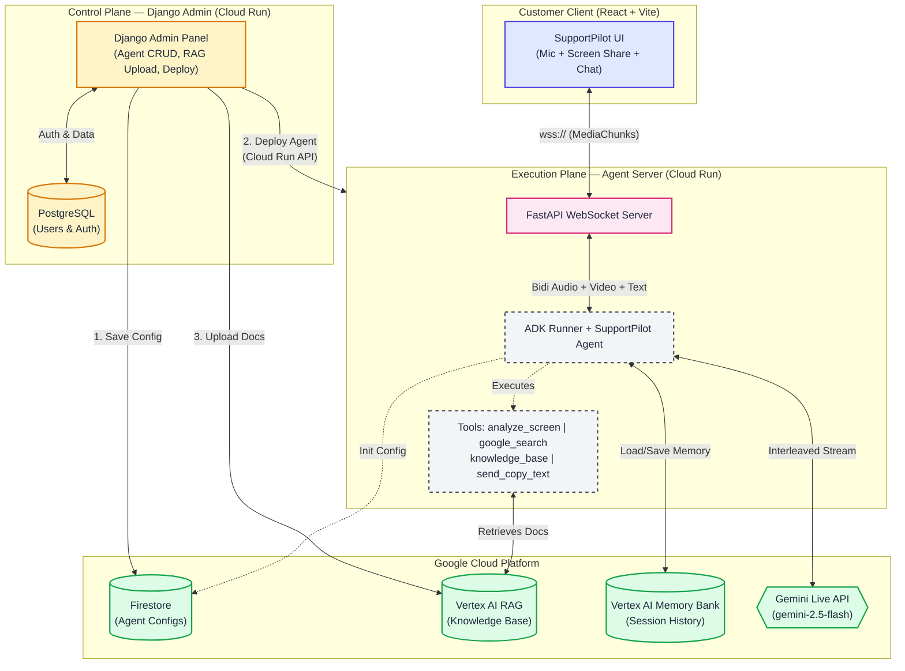
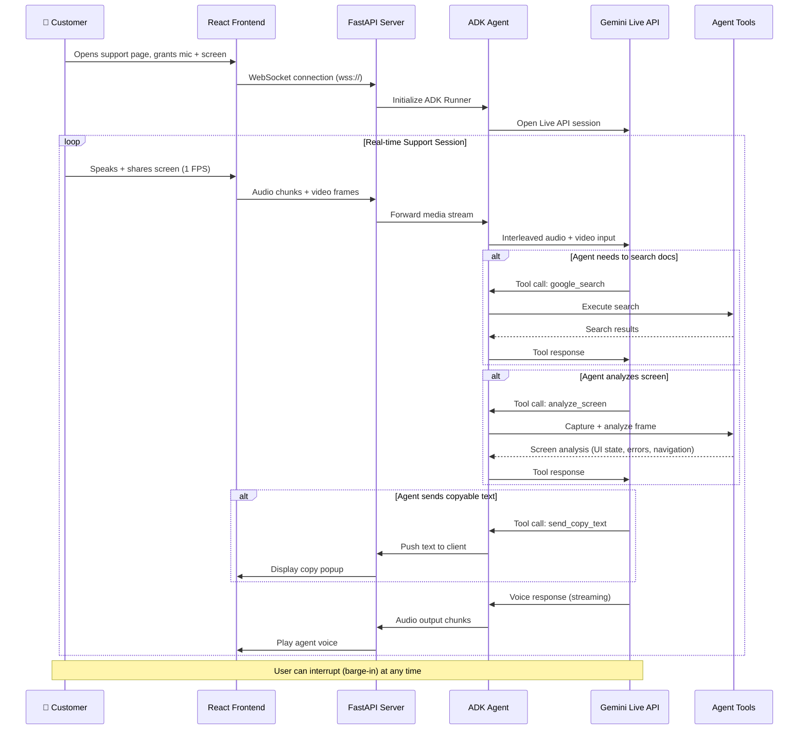

# SupportPilot

> **See my screen. Hear my voice. Solve my problem.**

SupportPilot is a real-time, multimodal AI customer support agent that **sees your screen**, **hears your voice**, and **guides you step-by-step** through complex SaaS software — ERP systems, cloud consoles, admin panels, and more.

Most support bots are turn-based text chatbots. SupportPilot breaks the "text box" paradigm with a fully live, interruptible voice agent powered by Google's Gemini Live API and Agent Development Kit.

🏆 **Category:** Live Agents — [Gemini Live Agent Challenge](https://geminiliveagentchallenge.devpost.com)

---

## ✨ Key Features

| Feature                           | Description                                                                                                 |
| --------------------------------- | ----------------------------------------------------------------------------------------------------------- |
| 🎙️ **Live Voice Conversation**    | Natural, real-time voice interaction powered by Gemini Live API. No turn-taking — just talk.                |
| 👁️ **Screen Vision**              | Passively observes the user's screen at 1 FPS. The agent _sees_ what you see and gives precise guidance.    |
| 🔊 **Barge-in / Interruption**    | Interrupt the agent mid-sentence — it stops immediately and listens. Natural conversation flow.             |
| 📋 **Copy-to-Clipboard**          | Agent pushes text, code snippets, or config values directly to the user's screen for easy copy-paste.       |
| 🔍 **Google Search (Grounded)**   | Searches official documentation domains in real-time. No hallucinations — answers grounded in real sources. |
| 📚 **Knowledge Base (RAG)**       | Upload internal PDFs, SOPs, or manuals. The agent searches them via Vertex AI RAG for precise answers.      |
| 🧠 **Session Memory**             | Uses Vertex AI Memory Bank. Users can return later and the agent remembers past interactions.               |
| 🏗️ **Multi-Tenant Admin Panel**   | Django-based dashboard to create, configure, and deploy new agents — no code required.                      |
| 🚀 **One-Click Cloud Deployment** | Deploy agents directly to Google Cloud Run from the admin panel UI.                                         |
| 🤖 **AI Prompt Generator**        | Auto-generates system prompts with built-in tool usage guidance using Gemini.                               |

---

## 🎬 Links for Judges

| Resource                 | Link                                                         |
| ------------------------ | ------------------------------------------------------------ |
| **Demo Video**           | [YouTube Link — Insert Here]                                 |
| **GCP Deployment Proof** | [YouTube Link — Insert Here]                                 |
| **Live Demo**            | [Cloud Run URL — Insert Here]                                |
| **Architecture Diagram** | [architecture.md](architecture.md)                           |
| **Admin Panel Guide**    | [ADMIN_PANEL_USER_GUIDE.md](admin/ADMIN_PANEL_USER_GUIDE.md) |
| **RAG Guide**            | [RAG_USER_GUIDE.md](admin/RAG_USER_GUIDE.md)                 |
| **CI/CD Guide**          | [GITHUB_ACTIONS_DEPLOYMENT.md](GITHUB_ACTIONS_DEPLOYMENT.md) |

---

## 🏗️ Architecture

SupportPilot is designed as a **multi-tenant SaaS platform** with two planes:

- **Control Plane (Admin)** — Django dashboard for managing agents, knowledge bases, and deployments
- **Execution Plane (Agent)** — FastAPI + ADK server that handles live voice/vision sessions



> 👉 [See the detailed architecture breakdown](architecture.md)

---

## 🛠️ Tech Stack (Google Cloud Native)

| Layer               | Technology                         | Purpose                                             |
| ------------------- | ---------------------------------- | --------------------------------------------------- |
| **AI Model**        | Gemini 2.5 Flash (Live API)        | Real-time voice + vision processing                 |
| **Agent Framework** | Google Agent Development Kit (ADK) | Agent lifecycle, tool execution, session management |
| **SDK**             | Google GenAI SDK                   | Gemini API access for screen analysis               |
| **Knowledge Base**  | Vertex AI RAG                      | PDF/document retrieval for grounded answers         |
| **Memory**          | Vertex AI Memory Bank              | Cross-session user context retention                |
| **Database**        | Cloud Firestore                    | Agent configuration storage                         |
| **Hosting**         | Google Cloud Run                   | Serverless container deployment (admin + agents)    |
| **Admin Backend**   | Django + Firestore                 | Agent management dashboard                          |
| **Agent Backend**   | FastAPI + WebSockets               | Real-time bidirectional communication               |
| **Frontend**        | React + Vite + TypeScript          | Customer-facing support UI                          |
| **CI/CD**           | GitHub Actions                     | Automated build and deployment pipeline             |
| **Container**       | Docker + Docker Compose            | Local development and production builds             |

### Third-Party Integrations

- **Google Cloud Platform** — Cloud Run, Firestore, Vertex AI (RAG + Memory Bank), Gemini API
- **React + Vite** — Frontend framework for the customer support UI

All third-party tools are used in accordance with their respective licenses and terms of service.

---

## 🚀 Spin-Up Instructions

### Prerequisites

1. **Python 3.11+** and **Node.js 18+** (with `pnpm`)
2. **Google Cloud CLI** (`gcloud`) — [Install Guide](https://cloud.google.com/sdk/docs/install)
3. A GCP project with billing enabled
4. Enable required APIs:
   ```bash
   gcloud services enable \
     run.googleapis.com \
     cloudbuild.googleapis.com \
     firestore.googleapis.com \
     aiplatform.googleapis.com
   ```

---

### Option 1: Docker Compose (Recommended for Local Dev)

The fastest way to get everything running locally.

**Step 1 — Configure environment variables:**

```bash
# Admin panel
cd admin
cp .env.example .env
# Edit .env → set GOOGLE_CLOUD_PROJECT and GOOGLE_CLOUD_LOCATION

# Agent server
cd ../agent
cp .env.example .env
# Edit .env → set GOOGLE_CLOUD_PROJECT and GOOGLE_CLOUD_LOCATION
```

**Step 2 — Authenticate with Google Cloud:**

```bash
gcloud auth application-default login
```

**Step 3 — Start all services:**

```bash
docker-compose up --build
```

**Step 4 — Access the application:**

| Service         | URL                         |
| --------------- | --------------------------- |
| Admin Panel     | http://localhost:8000       |
| Agent Frontend  | http://localhost:8080       |
| Agent WebSocket | ws://localhost:8080/ws/live |

**Step 5 — Create your first agent:**

1. Go to http://localhost:8000 → Register an account
2. Click **"Seed Demo Agent"** to create a pre-configured SaaS support agent
3. Or click **"Create Agent"** to build your own from scratch
4. Open the agent frontend at http://localhost:8080 to start a live support session

---

### Option 2: Deploy to Google Cloud

Use the included deployment script to push everything to Cloud Run.

**Step 1 — Login and set your project:**

```bash
gcloud auth login
gcloud config set project YOUR_PROJECT_ID
```

**Step 2 — Run the deployment script:**

```bash
chmod +x deploy.sh
./deploy.sh
```

This will:

1. Build the agent Docker image and push to Container Registry
2. Deploy the Django admin panel to Cloud Run
3. Output the live admin panel URL

**Step 3 — Grant IAM permissions for agent deployment:**

The admin panel needs permission to dynamically spin up Cloud Run containers. In the [IAM Console](https://console.cloud.google.com/iam-admin/iam), grant the **Compute Engine default service account** these roles:

- `Cloud Run Admin`
- `Service Account User`
- `Artifact Registry Administrator`
- `Service Usage Consumer`
- `Cloud Datastore User`

---

### Option 3: GitHub Actions CI/CD (Automated)

The repository includes a fully automated CI/CD pipeline. Pushing to `main` triggers:

1. Agent image build + push to Container Registry
2. Admin panel deployment to Cloud Run

👉 [Read the full GitHub Actions Deployment Guide](GITHUB_ACTIONS_DEPLOYMENT.md)

---

## 📁 Repository Structure

```text
support-pilot/
├── admin/                          # Django Admin Panel
│   ├── agents/                     # Agent CRUD, RAG management, deployment
│   │   ├── templates/              # HTML templates (Jinja2)
│   │   ├── views.py                # Views + AI prompt generation
│   │   ├── forms.py                # Agent creation forms
│   │   └── models.py               # User model
│   ├── livecustomersupport/        # Django project settings
│   ├── ADMIN_PANEL_USER_GUIDE.md   # Admin panel documentation
│   ├── RAG_USER_GUIDE.md           # RAG knowledge base guide
│   ├── Dockerfile                  # Admin container
│   └── requirements.txt
│
├── agent/                          # AI Agent Server
│   ├── client/                     # React + Vite Frontend
│   │   ├── src/                    # React components (TypeScript)
│   │   └── dist/                   # Production build
│   ├── server/                     # FastAPI Backend
│   │   ├── agent.py                # ADK agent loader (from Firestore config)
│   │   ├── tools.py                # analyze_screen, send_copy_text, etc.
│   │   ├── main.py                 # FastAPI app factory
│   │   ├── config.py               # Pydantic settings
│   │   └── routes/                 # WebSocket, health, config endpoints
│   ├── Dockerfile                  # Agent container
│   └── requirements.txt
│
├── .github/workflows/deploy.yml    # CI/CD pipeline
├── docker-compose.yml              # Local development setup
├── deploy.sh                       # Manual deployment script
├── architecture.md                 # Detailed architecture breakdown
└── GITHUB_ACTIONS_DEPLOYMENT.md    # CI/CD setup guide
```

---

## 🔍 How It Works

### The Support Session Flow



### Key Technical Decisions

1. **1 FPS Screen Capture** — Balances real-time awareness with bandwidth. The agent doesn't need 30fps to understand a UI.
2. **Passive Observation** — Screen frames are streamed continuously. The agent can reference what it sees without explicit tool calls.
3. **Interleaved I/O** — Audio and video flow simultaneously through the same Gemini Live API session.
4. **Dynamic Agent Provisioning** — Each agent gets its own Cloud Run container with isolated config, tools, and knowledge base.
5. **Grounding via RAG + Search** — Prevents hallucinations by anchoring responses in uploaded documents and official documentation.

---

## 📝 Findings & Learnings

1. **Gemini Live API is remarkably responsive** — barge-in handling feels natural, almost human-like. The agent stops mid-word when interrupted.
2. **Screen vision at 1 FPS is sufficient** — for SaaS admin panels that don't change rapidly, one frame per second provides enough context for the agent to guide effectively.
3. **Tool orchestration matters** — giving the agent clear tool usage guidelines in the system instruction dramatically improves tool selection accuracy.
4. **RAG grounding eliminates hallucinations** — when the agent has access to uploaded documentation, it cites specific sections instead of guessing.
5. **Multi-tenant architecture scales well** — deploying each agent as an isolated Cloud Run service means one bad config doesn't affect others.

---

## 📄 License

This project was created for the [Gemini Live Agent Challenge](https://geminiliveagentchallenge.devpost.com) hackathon.

Built with ❤️ using Google Cloud, Gemini, and the Agent Development Kit.
