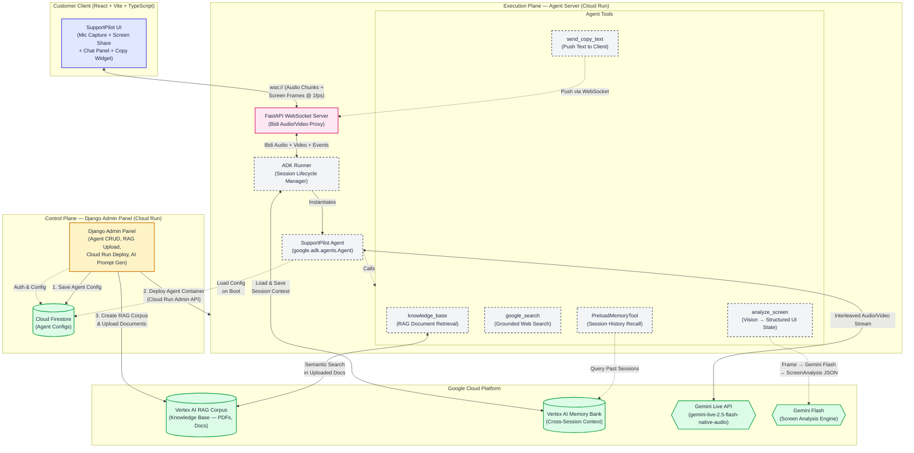
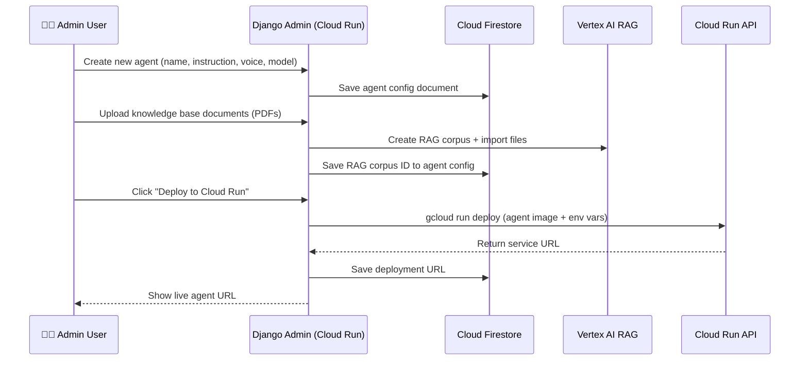
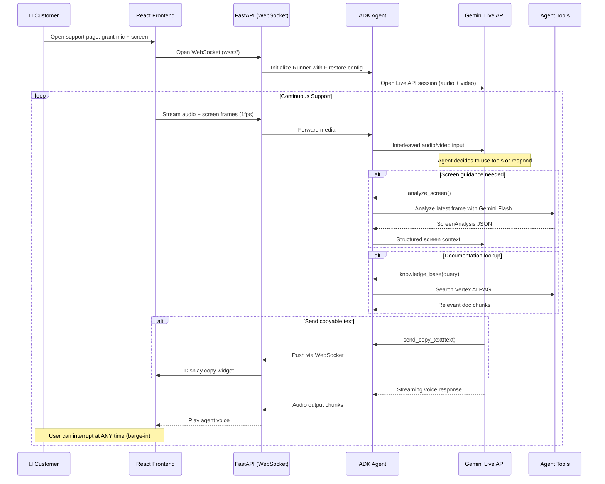
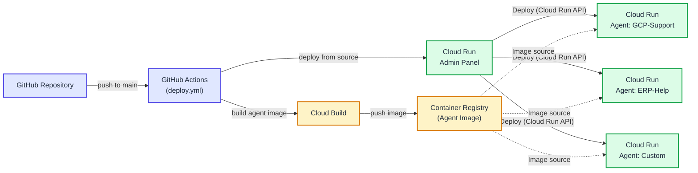

# SupportPilot — Architecture Overview

## System Architecture

SupportPilot is built as a **multi-tenant SaaS platform** with two distinct planes, fully hosted on Google Cloud.

---

## Component Deep Dive

### 1. Control Plane — Django Admin Panel

The admin panel is a full-featured web dashboard deployed on **Cloud Run**. It enables non-technical support managers to manage the entire agent lifecycle.

| Capability | Implementation |
|---|---|
| **User Auth** | Django auth with Firestore backend |
| **Agent CRUD** | Create, edit, delete agents with custom instructions, voice, and model |
| **AI Prompt Generation** | One-click system prompt generation using Gemini, with built-in tool usage guidance |
| **RAG Knowledge Base** | Upload PDFs/docs → creates Vertex AI RAG Corpus → auto-linked to agent |
| **Cloud Deployment** | One-click deploy to Cloud Run via `gcloud` API — each agent gets an isolated container |
| **Google Search Config** | Toggle on/off, set allowed search domains (e.g., `cloud.google.com/docs`) |
| **Demo Seeder** | Pre-configured SaaS demo agent with realistic system instruction |

### 2. Execution Plane — Agent Server

Each agent runs in its own **Cloud Run** container. On boot, it loads its config from **Firestore** and initializes the ADK agent with the appropriate tools, voice, and instruction.

| Component | Technology | Role |
|---|---|---|
| **WebSocket Server** | FastAPI | Bidirectional proxy between React client and ADK |
| **ADK Runner** | `google.adk.runners.Runner` | Manages the live session lifecycle with Gemini |
| **Agent** | `google.adk.agents.Agent` | Core agent with system instruction, tools, and model config |
| **Screen State** | In-memory frame buffer | Stores latest screen capture for `analyze_screen` tool |

### 3. Customer Client — React Frontend

A React + Vite + TypeScript SPA that handles:

- **Microphone capture** → streams audio chunks over WebSocket
- **Screen sharing** → captures at 1 FPS, sends JPEG frames
- **Chat panel** → displays transcription and agent-pushed guides
- **Copy widget** → receives `send_copy_text` events and shows copy-to-clipboard UI

### 4. Agent Tools

| Tool | Input | Output | Google Cloud Service |
|---|---|---|---|
| `analyze_screen` | Latest screen frame (JPEG) | Structured JSON: `page_title`, `visible_sections`, `user_focus`, `error_messages`, `navigation_hints` | Gemini Flash (GenAI SDK) |
| `google_search` | Query string | Web search results from allowed domains | Google Search (ADK built-in) |
| `knowledge_base` | Query string | Relevant document chunks from uploaded PDFs | Vertex AI RAG |
| `send_copy_text` | Text/code string | Pushes to client clipboard widget | WebSocket (internal) |
| `PreloadMemoryTool` | Session ID | Past conversation context | Vertex AI Memory Bank |

---

## Data Flow

### Agent Provisioning Flow

### Live Support Session Flow

---

## Google Cloud Services Used

| Service | Usage | Why |
|---|---|---|
| **Cloud Run** | Hosts admin panel + each deployed agent as isolated containers | Serverless, auto-scaling, per-agent isolation |
| **Cloud Firestore** | Stores agent configs, user accounts, and sessions | Real-time, schemaless, single database for everything |
| **Vertex AI RAG** | Knowledge base — uploaded PDFs are chunked, embedded, and searchable | Grounded answers from internal documentation |
| **Vertex AI Memory Bank** | Cross-session memory — remembers users across visits | Continuity without repetition |
| **Gemini Live API** | Core voice + vision processing — real-time, interruptible | Native barge-in, interleaved audio/video |
| **Gemini Flash** | Screen analysis — converts screenshots to structured data | Fast inference for UI understanding |
| **Cloud Build** | Docker image builds (via GitHub Actions and deploy.sh) | Automated CI/CD |
| **Container Registry** | Stores agent Docker images | Image management for Cloud Run |

---

## Deployment Architecture

Each agent is deployed as an **isolated Cloud Run service** with its own:
- System instruction and persona
- Gemini model configuration
- Voice selection (Kore, Puck, Charon, etc.)
- Google Search domains
- RAG knowledge base (Vertex AI corpus)
- Memory bank session storage
